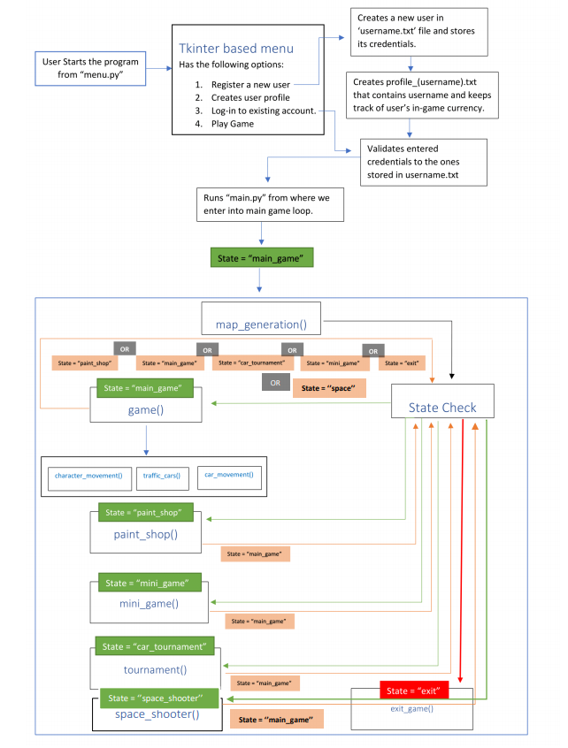

# Project Title

Project BlackWolf

## Group Details

**Group Name**: Alpha Dev


**Group Members:**
  - Muhammad Mustafa
  - Muhammad Taha Naveed
  - Manahil Ashraf
  - Muhammad Danish


## Project Description
We've created a small 2D game (inspiration taken from games like GTA1) using Python Libraries i.e., Pygame, Tkinter, etc.

## Features
Basic features of our game include:


  - Player movement.
  - Interaction with Environment (Collision).
  - Driving Cars.
  - Traffic system.
  - In-game currency System.
  - Paint shop for car customization.
  - Car avoiding mini-game, Space shooter mini-game and a Car Tournament implemented within the main game.


## Technical Architecture



## Installation and Running Project BlackWolf
**Requirements**

You need to have installed:

  - [Python3](https://www.python.org/downloads/release/python-391/)
  - Pygame Library
  - Pillow Library
  - Tkinter Library (comes in by-default with Python3)


**Installation guide**

After installation of [Python3](https://www.python.org/downloads/release/python-391/), you need to install Pygame and Pillow (Python Libraries).


Installation procedure of required Python libraries is as follows:

1. Open 'Command Prompt' (cmd) by typing cmd in Start menu or press Win + R and typing cmd.

2. To install a python library type in: 


```bash
pip install *library_name*
```


3. For installing Pygame, type in:

 ```bash
 pip install pygame
 ```

Similarly, for pillow:

```bash
pip install pillow
```


**Running the game**

Within the root directory, launch the game from 'menu.py'.

1. A menu will launch in which you will be prompted to enter in your login credentials to play the game.

2. In case of a new user, register your account first by clicking on "Register".

3. Login with your credentials which will open a new prompt. Click on 'Play Game'.

**Controls**


Movement: **Up, Down, Left, Right** Arrow keys

Interact: **"F"** key (to get into and out of a car.)

## Updates

**Update v1.01.0 (March 1, 2021)**

**Changes**

- Fixed coins not properly being updated to user_profile.txt from Car Tournament and Space Shooter mini-game. 
- Fixed collision models to accept collision from either side and allow user to escape out of the 4 in-game regions (Paint shop, f1_racer, tournament, space-shooter). Previously, if you would collide with the rects at a certain angle, the escape condition would fail.  
- Fixed a bug with space-shooter mini-game which would cause the game to crash if you played the mini-game more than once. 
- Miscellaneous quality of code improvements. 
 

**Known Issues**
- The camera-view gets disrupted when colliding with objects with a car causing the car to go out of center of view.
- Cannot play the Car Race Tournament more than once.
